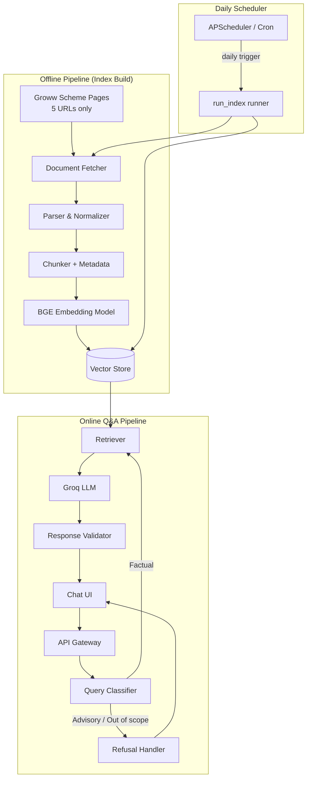
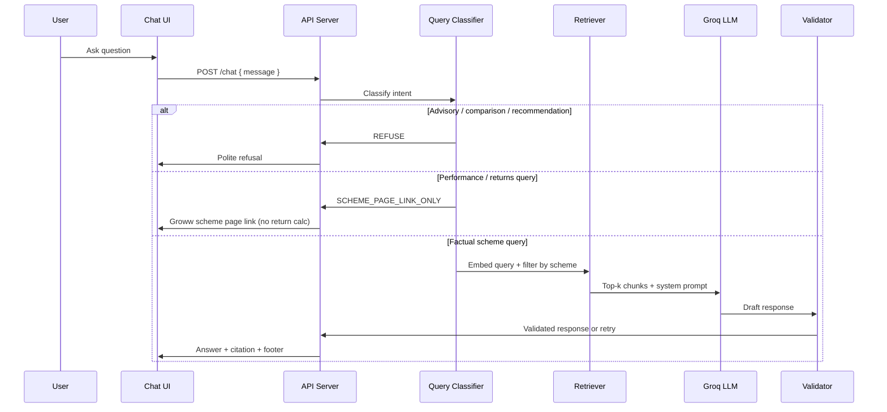
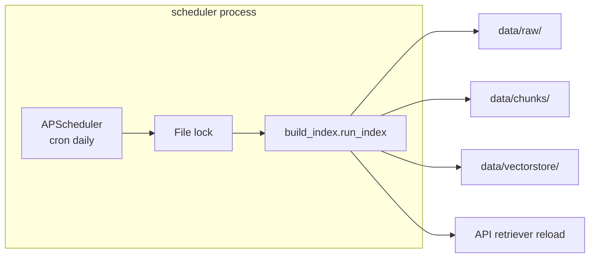
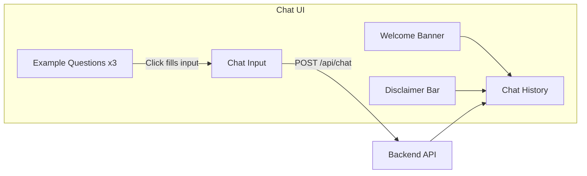
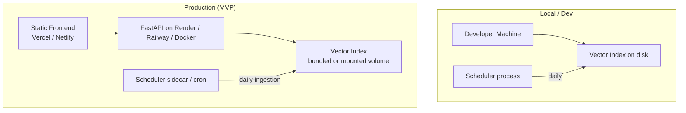

# Architecture: HDFC Mutual Fund FAQ Assistant

This document describes the system architecture for a **facts-only, RAG-based FAQ assistant** scoped to five HDFC Mutual Fund schemes. It is derived from [problemStatement.md](./problemStatement.md).

---

## 1. Architecture Goals

| Goal | Design implication |
|------|-------------------|
| **Accuracy over intelligence** | Retrieval-first; LLM synthesizes only from retrieved chunks |
| **Source-backed answers** | Every response includes exactly one citation link to the relevant Groww scheme page |
| **Compliance** | Advisory queries are blocked before generation; no PII collection |
| **Lightweight** | Offline index build, simple API + minimal UI, no user accounts |
| **Transparency** | Short answers (≤3 sentences), footer with last-updated date |

---

## 2. High-Level System Overview

The system is split into three operational modes:

1. **Offline ingestion** — Fetch, parse, chunk, embed, and index content from the five Groww scheme pages.
2. **Scheduled refresh** — A daily scheduler re-runs the offline pipeline so corpus metadata (NAV, expense ratio, etc.) stays current.
3. **Online Q&A** — Classify query → retrieve relevant chunks → generate constrained response → validate output.



---

## 3. Component Architecture

### 3.1 Document Ingestion Layer

Responsible for building and refreshing the knowledge corpus from the **five Groww scheme pages only**. No PDFs, AMC documents, or other external sources are ingested.

| Component | Responsibility |
|-----------|----------------|
| **Source Registry** | YAML/JSON config listing the five Groww scheme URLs |
| **Fetcher** | HTTP client with rate limiting; downloads HTML from Groww scheme pages |
| **Parser** | Extracts text from HTML (BeautifulSoup / readability); strips nav, footer, and ads |
| **Normalizer** | Strips boilerplate, normalizes tables (expense ratio, exit load, SIP minimums) |
| **Chunker** | Splits page content into overlapping semantic chunks (~300–500 tokens, 50-token overlap) |
| **Metadata Enricher** | Tags each chunk with `scheme_name`, `category`, `source_url`, `last_fetched_at` |

#### Corpus sources (Groww only)

The entire RAG corpus is built exclusively from these five URLs:

| Scheme | Groww URL |
|--------|-----------|
| HDFC Large Cap Fund Direct Growth | https://groww.in/mutual-funds/hdfc-large-cap-fund-direct-growth |
| HDFC Mid Cap Fund Direct Growth | https://groww.in/mutual-funds/hdfc-mid-cap-fund-direct-growth |
| HDFC Small Cap Fund Direct Growth | https://groww.in/mutual-funds/hdfc-small-cap-fund-direct-growth |
| HDFC Gold ETF Fund of Fund Direct Plan Growth | https://groww.in/mutual-funds/hdfc-gold-etf-fund-of-fund-direct-plan-growth |
| HDFC Silver ETF FoF Direct Growth | https://groww.in/mutual-funds/hdfc-silver-etf-fof-direct-growth |

> **Rule:** These five Groww URLs are the **only** external sources. No PDFs, factsheets, KIM, SID, AMFI, or SEBI documents are fetched or indexed. Citations in responses point back to the relevant Groww scheme page.

#### Chunk metadata schema

```json
{
  "chunk_id": "hdfc-mid-cap-groww-2026-07-003",
  "scheme_name": "HDFC Mid Cap Fund Direct Growth",
  "scheme_category": "Equity — Mid Cap",
  "source_url": "https://groww.in/mutual-funds/hdfc-mid-cap-fund-direct-growth",
  "source_domain": "groww.in",
  "section": "exit_load",
  "text": "...",
  "last_fetched_at": "2026-07-03T00:00:00Z",
  "token_count": 412
}
```

---

### 3.2 Embedding & Vector Store

| Component | Recommended choice | Rationale |
|-----------|-------------------|-----------|
| **Embedding model** | `BAAI/bge-small-en-v1.5` (local via Sentence Transformers) | Strong retrieval quality; no embedding API cost |
| **Vector store** | ChromaDB or FAISS (local file) | No external DB dependency for MVP |
| **Similarity metric** | Cosine similarity | Standard for semantic retrieval |
| **Top-k retrieval** | k = 5–8 chunks | Balance recall vs. context window |

#### BGE embedding configuration

| Setting | Value |
|---------|-------|
| **Model** | `BAAI/bge-small-en-v1.5` (configurable via `BGE_MODEL_NAME`) |
| **Library** | Sentence Transformers (local inference — no API key) |
| **Document encoding** | Embed chunk text as-is |
| **Query encoding** | Prefix with `Represent this sentence for searching relevant passages: ` (BGE retrieval best practice) |
| **Similarity** | Cosine similarity on normalized embeddings |

#### Groq LLM configuration

| Setting | Value |
|---------|-------|
| **Provider** | [Groq API](https://console.groq.com) via `groq` Python SDK |
| **Default model** | `llama-3.3-70b-versatile` (configurable via `GROQ_MODEL`) |
| **Fast alternative** | `llama-3.1-8b-instant` for lower latency during development |
| **Env var** | `GROQ_API_KEY` |

#### Index structure

```
data/
├── raw/                  # Downloaded Groww HTML pages (5 files)
├── processed/            # Cleaned plain text per scheme page
├── chunks/               # Chunked JSONL with metadata
└── vectorstore/          # Persisted embeddings (Chroma/FAISS)
```

Re-indexing is triggered manually (`python scripts/build_index.py`), via `POST /api/reindex` (dev), or **automatically by the daily scheduler** (see §3.8).

---

### 3.3 Query Processing Pipeline



#### Query classifier

A lightweight rules + Groq hybrid classifier runs **before** retrieval:

| Intent | Examples | Action |
|--------|----------|--------|
| `FACTUAL` | "What is the expense ratio of HDFC Mid Cap?" | Retrieve → generate |
| `ADVISORY` | "Should I invest in this fund?" | Refuse |
| `COMPARISON` | "Which fund is better?" | Refuse |
| `PERFORMANCE` | "What returns did HDFC Small Cap give?" | Link to relevant Groww scheme page only |
| `OUT_OF_SCOPE` | Unrelated to HDFC schemes / mutual funds | Refuse with scope message |
| `PII_DETECTED` | PAN, Aadhaar, account numbers | Block immediately |

Rule-based keyword patterns handle obvious advisory phrases; a Groq LLM fallback classifies edge cases.

---

### 3.4 Retrieval Layer

| Step | Description |
|------|-------------|
| **Query embedding** | Embed user question with the same model used at index time |
| **Vector search** | Cosine similarity against full index |
| **Metadata filter** | If scheme is detected in query, filter chunks by `scheme_name` |
| **Re-ranking (optional)** | Cross-encoder or keyword overlap boost for fields like `expense_ratio`, `exit_load` |
| **Context assembly** | Concatenate top-k chunks; deduplicate by `source_url` |

#### Scheme name resolution

Map user aliases to canonical scheme names:

| User may say | Canonical name |
|--------------|----------------|
| "large cap", "HDFC large cap" | HDFC Large Cap Fund Direct Growth |
| "mid cap" | HDFC Mid Cap Fund Direct Growth |
| "small cap" | HDFC Small Cap Fund Direct Growth |
| "gold fund", "gold etf fof" | HDFC Gold ETF Fund of Fund Direct Plan Growth |
| "silver fund", "silver etf" | HDFC Silver ETF FoF Direct Growth |

---

### 3.5 Generation Layer

The Groq LLM receives a strict system prompt enforcing output constraints.

#### System prompt constraints

1. Answer **only** from provided context chunks.
2. Maximum **3 sentences** in the answer body.
3. Include **exactly one** source URL from the retrieved chunks.
4. Do not give investment advice, opinions, or recommendations.
5. Do not compute or compare returns.
6. If context is insufficient, say so and link to the relevant Groww scheme page.
7. Append footer: `Last updated from sources: <date>` using the newest `last_fetched_at` among retrieved chunks.

#### Example response format

```
The expense ratio of HDFC Mid Cap Fund Direct Growth is 0.75% for the Direct Growth plan.

Source: https://groww.in/mutual-funds/hdfc-mid-cap-fund-direct-growth

Last updated from sources: 2026-07-03
```

---

### 3.6 Response Validator

Post-generation checks before returning to the user:

| Check | Failure action |
|-------|----------------|
| Sentence count ≤ 3 | Truncate or regenerate |
| Exactly 1 URL present | Regenerate or inject best `source_url` from chunks |
| URL domain is `groww.in` and matches a corpus scheme page | Reject; inject correct `source_url` from chunks |
| No advisory language ("you should", "I recommend", "better fund") | Regenerate or refuse |
| No return calculations or performance figures | Replace with Groww scheme page link |
| Footer date present | Append from chunk metadata |

---

### 3.7 Refusal Handler

For `ADVISORY`, `COMPARISON`, and `OUT_OF_SCOPE` intents:

```
I can only answer factual questions about the five supported HDFC Mutual Fund schemes 
using information from their Groww fund pages. I cannot provide investment advice or 
fund recommendations.
```

Refusal responses are template-based (no Groq call) to guarantee compliance wording.

---

### 3.8 Ingestion Scheduler

Keeps the corpus fresh by re-running the offline ingestion pipeline on a **daily schedule** without live fetching at request time.

| Component | Responsibility |
|-----------|----------------|
| **Scheduler config** | `SCHEDULE_ENABLED`, `SCHEDULE_DAILY_AT`, `SCHEDULE_TIMEZONE` in `.env` |
| **Job runner** | Invokes `run_index()` — fetch → parse → chunk → embed → persist vectorstore |
| **Concurrency lock** | File lock (`data/.ingestion.lock`) prevents overlap with manual reindex |
| **Index hot-reload** | Calls `retriever.reset_collection()` after successful build so API serves new data without restart |
| **Audit log** | Appends run metadata to `data/ingestion_log.jsonl` (start, end, chunk count, status) |



#### Design constraints

| Constraint | Rationale |
|------------|-----------|
| **No fetch at chat time** | User queries always hit a pre-built index; scheduler refreshes offline |
| **Fail-safe** | Failed run retains previous vectorstore; errors logged, not silently dropped |
| **Single runner** | Lock ensures scheduler and `POST /api/reindex` never run concurrently |
| **Low-traffic window** | Default 02:00 `Asia/Kolkata` to minimize Groww load and dev disruption |

#### Operational entrypoints

| Command | Purpose |
|---------|---------|
| `python scripts/run_scheduler.py` | Start long-running scheduler process |
| `python scripts/run_scheduler.py --run-now` | One-shot ingestion (testing) |
| `python scripts/build_index.py` | Manual full pipeline (unchanged) |

---

## 4. API Design

### Endpoints

| Method | Path | Description |
|--------|------|-------------|
| `POST` | `/api/chat` | Submit a user question; returns answer or refusal |
| `GET` | `/api/health` | Service health check |
| `GET` | `/api/schemes` | List supported schemes (for UI) |
| `POST` | `/api/reindex` | Trigger corpus re-ingestion (admin/dev only) |
| `GET` | `/api/ingestion/status` | Last scheduled/manual ingestion run metadata (read-only) |

### `POST /api/chat` request / response

**Request:**

```json
{
  "message": "What is the minimum SIP for HDFC Large Cap Fund Direct Growth?"
}
```

**Response (factual):**

```json
{
  "type": "answer",
  "message": "The minimum SIP for HDFC Large Cap Fund Direct Growth is ₹100.\n\nSource: https://groww.in/mutual-funds/hdfc-large-cap-fund-direct-growth\n\nLast updated from sources: 2026-07-03",
  "citation_url": "https://groww.in/mutual-funds/hdfc-large-cap-fund-direct-growth",
  "scheme": "HDFC Large Cap Fund Direct Growth",
  "last_updated": "2026-07-03"
}
```

**Response (refusal):**

```json
{
  "type": "refusal",
  "message": "I can only answer factual questions about the five supported HDFC Mutual Fund schemes. I cannot provide investment advice or fund recommendations."
}
```

### Privacy

- No request logging of message content in production (or anonymized only).
- No fields for PAN, Aadhaar, account numbers, OTP, email, or phone.
- Stateless API — no user sessions or authentication required for MVP.

---

## 5. Frontend Architecture

Minimal chat UI aligned with the problem statement.



### UI elements

| Element | Content |
|---------|---------|
| **Welcome** | "Ask factual questions about HDFC Mutual Fund schemes — expense ratio, exit load, SIP minimums, benchmarks, and more." |
| **Disclaimer** | "Facts-only. No investment advice." (always visible) |
| **Example questions** | Pre-filled chips for expense ratio, exit load, and benchmark queries |
| **Chat area** | User messages + assistant responses with clickable source link |
| **Loading state** | "Searching fund information…" |

### Recommended stack

| Layer | Option A (simple) | Option B (full-stack) |
|-------|-------------------|----------------------|
| Frontend | HTML + vanilla JS | React / Next.js |
| Backend | FastAPI (Python) | FastAPI or Node.js |
| Styling | Tailwind CSS | Tailwind CSS |

---

## 6. Technology Stack Summary

| Layer | Technology |
|-------|-----------|
| Language | Python 3.11+ |
| Web framework | FastAPI |
| HTML parsing | BeautifulSoup4, readability-lxml |
| Embeddings | BGE — `BAAI/bge-small-en-v1.5` via Sentence Transformers (local) |
| Vector DB | ChromaDB |
| LLM | Groq API — `llama-3.3-70b-versatile` (or `llama-3.1-8b-instant` for lower latency) |
| Orchestration | LangChain or LlamaIndex (optional) |
| Scheduler | APScheduler (daily ingestion job) |
| Frontend | React or static HTML |
| Config | `.env` for `GROQ_API_KEY`; `config/sources.yaml` for corpus URLs |

---

## 7. Project Structure (Proposed)

```
RAG Chat Bot/
├── docs/
│   ├── problemStatement.md
│   └── Architecture.md
├── config/
│   └── sources.yaml           # Corpus URL registry
├── ingestion/
│   ├── fetcher.py
│   ├── parser.py
│   ├── chunker.py
│   └── indexer.py
├── rag/
│   ├── classifier.py          # Query intent classification
│   ├── retriever.py
│   ├── generator.py
│   └── validator.py
├── api/
│   ├── main.py                # FastAPI app
│   └── routes/
│       ├── chat.py
│       └── ingestion.py       # Ingestion status (optional)
├── scheduler/
│   ├── app.py                 # APScheduler setup
│   ├── config.py              # Schedule env config
│   └── runner.py              # Locked run_index wrapper + hot-reload
├── ui/
│   └── ...                    # Frontend app
├── data/
│   ├── raw/
│   ├── processed/
│   ├── chunks/
│   ├── vectorstore/
│   └── ingestion_log.jsonl    # Scheduler audit trail
├── scripts/
│   ├── build_index.py         # One-command index build
│   └── run_scheduler.py       # Start daily scheduler
├── tests/
│   ├── test_classifier.py
│   ├── test_retriever.py
│   └── test_validator.py
├── .env.example
└── README.md
```

---

## 8. Data Flow: End-to-End Example

**User query:** "What is the exit load on HDFC Gold ETF Fund of Fund?"

| Step | Action |
|------|--------|
| 1 | UI sends `POST /api/chat` |
| 2 | Classifier → `FACTUAL`; resolves scheme → `HDFC Gold ETF Fund of Fund Direct Plan Growth` |
| 3 | Retriever embeds query, filters by scheme, returns chunks from Groww page mentioning exit load |
| 4 | Groq LLM generates: "Exit load of 1% applies if redeemed within 15 days." + Groww scheme page citation |
| 5 | Validator confirms ≤3 sentences, 1 `groww.in` URL, footer date |
| 6 | UI renders answer with clickable source link |

---

## 9. Security & Compliance

| Area | Measure |
|------|---------|
| **Source integrity** | Allowlist domain: `groww.in` — only the five configured scheme URLs |
| **PII guard** | Regex + classifier block on PAN/Aadhaar/account/OTP patterns |
| **Advisory guard** | Pre-retrieval intent filter + post-generation language check |
| **Performance guard** | Return Groww scheme page link only; never compute or state returns |
| **API keys** | `GROQ_API_KEY` stored in `.env`; never committed to git. BGE runs locally — no embedding API key required |
| **Rate limiting** | Basic per-IP throttle on `/api/chat` to prevent abuse |

---

## 10. Deployment Architecture



| Environment | Setup |
|-------------|-------|
| **Local dev** | `python scripts/build_index.py` → `uvicorn api.main:app` → open UI; optional `python scripts/run_scheduler.py` |
| **Production MVP** | Docker image with pre-built index; no live crawling at request time |
| **Index refresh** | Daily scheduler re-runs ingestion pipeline (default 02:00 Asia/Kolkata) |

---

## 11. Testing Strategy

| Test type | What to verify |
|-----------|----------------|
| **Unit** | Chunker output, classifier intents, validator rules |
| **Integration** | Retrieval returns correct scheme chunks for known queries |
| **Golden-set Q&A** | 20–30 factual questions with expected fields (expense ratio, SIP, benchmark) |
| **Refusal set** | Advisory/comparison queries always refused |
| **Citation audit** | Every answer links to a valid Groww scheme page from the corpus |
| **Regression** | Re-run golden set after corpus re-index |

### Sample golden-set queries

| Query | Expected behavior |
|-------|-------------------|
| "Expense ratio of HDFC Mid Cap Fund Direct Growth?" | Factual answer + Groww citation |
| "Minimum SIP for HDFC Large Cap?" | "₹100" + Groww citation |
| "Benchmark for HDFC Large Cap?" | "NIFTY 100 Total Return Index" + Groww citation |
| "Should I invest in HDFC Small Cap?" | Refusal |
| "Which is better — large cap or mid cap?" | Refusal |
| "3-year return of HDFC Gold ETF FoF?" | Groww scheme page link only |

---

## 12. Known Limitations

| Limitation | Mitigation |
|------------|------------|
| Corpus may lag behind live NAV / expense ratio changes on Groww | Display `last_updated` footer; **daily scheduler** re-fetches Groww pages |
| Groww-only source — no AMC PDFs or regulatory docs | Scope limited to content visible on the five Groww pages |
| HTML parsing may miss dynamically loaded content | Prefer static extraction; manual QA on critical fields |
| Scheme name ambiguity | Canonical name mapping + clarification prompt |
| No multi-turn memory in MVP | Each query is independent (stateless) |
| English only | Out of scope for MVP |
| Five schemes only | Classifier rejects queries about other funds |

---

## 13. Success Criteria Mapping

| Problem statement criterion | Architecture feature |
|----------------------------|---------------------|
| Accurate factual retrieval | Metadata-filtered vector search + re-ranking |
| Facts-only responses | Query classifier + constrained prompt + validator |
| Valid source citations | `groww.in` allowlist + single-URL enforcement |
| Advisory refusal | Pre-retrieval refusal handler with facts-only messaging |
| Fresh corpus data | Daily scheduler re-runs offline ingestion pipeline |
| Clean minimal UI | Stateless chat with disclaimer and example questions |

---

## 14. Implementation Phases

| Phase | Deliverable | Duration (est.) |
|-------|-------------|-----------------|
| **Phase 1** | Corpus config, fetcher, parser, chunker | 2–3 days |
| **Phase 2** | BGE embeddings, vector index, retriever | 1–2 days |
| **Phase 3** | Classifier, Groq generator, validator, API | 2–3 days |
| **Phase 4** | Chat UI with disclaimer and examples | 1–2 days |
| **Phase 5** | Daily ingestion scheduler (APScheduler + `run_index`) | 0.5–1 day |
| **Phase 6** | Golden-set testing, README, polish | 1–2 days |

---

## 15. References

- [Problem Statement](./problemStatement.md)
- [HDFC Large Cap Fund Direct Growth](https://groww.in/mutual-funds/hdfc-large-cap-fund-direct-growth)
- [HDFC Mid Cap Fund Direct Growth](https://groww.in/mutual-funds/hdfc-mid-cap-fund-direct-growth)
- [HDFC Small Cap Fund Direct Growth](https://groww.in/mutual-funds/hdfc-small-cap-fund-direct-growth)
- [HDFC Gold ETF Fund of Fund Direct Plan Growth](https://groww.in/mutual-funds/hdfc-gold-etf-fund-of-fund-direct-plan-growth)
- [HDFC Silver ETF FoF Direct Growth](https://groww.in/mutual-funds/hdfc-silver-etf-fof-direct-growth)
