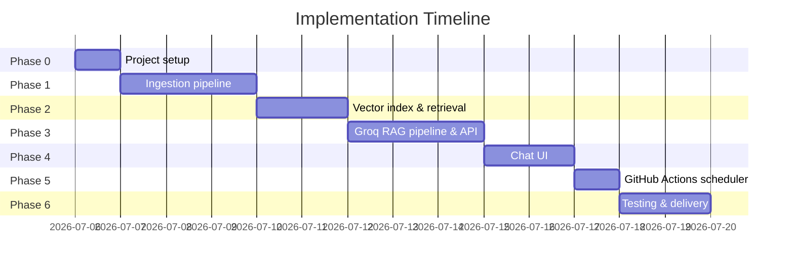
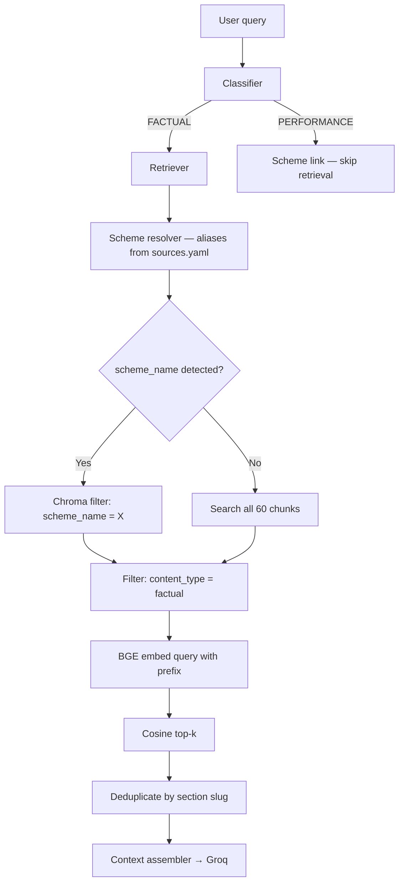
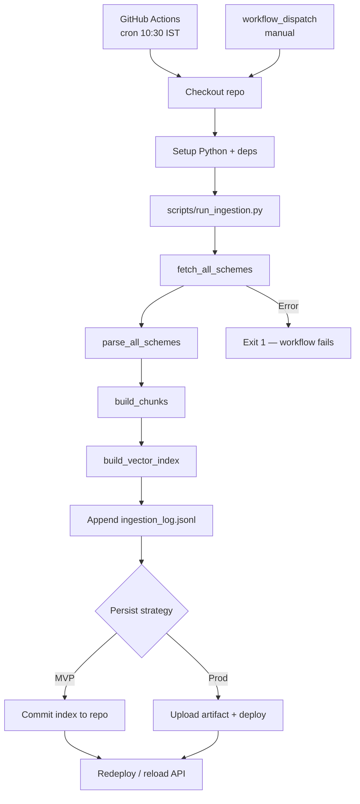
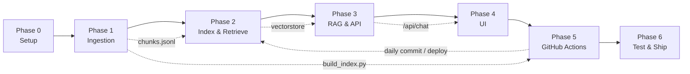

# Phase-Wise Implementation Plan

This document is the execution plan for building the **HDFC Mutual Fund FAQ Assistant**, derived from [Architecture.md](./Architecture.md) and [problemStatement.md](./problemStatement.md).

**Total estimated duration:** 9–14 days  
**Corpus scope:** Five Groww scheme pages only (no PDFs or other external sources)

---

## Overview



| Phase | Focus | Duration | Depends on |
|-------|-------|----------|------------|
| **Phase 0** | Project setup & scaffolding | 0.5–1 day | — |
| **Phase 1** | Groww ingestion pipeline | 2–3 days | Phase 0 |
| **Phase 2** | BGE embeddings, vector store, retriever | 1–2 days | Phase 1 |
| **Phase 3** | Classifier, Groq generator, validator, API | 2–3 days | Phase 2 |
| **Phase 4** | Chat UI | 1–2 days | Phase 3 |
| **Phase 5** | Daily ingestion scheduler (GitHub Actions) | 0.5–1 day | Phase 1, Phase 2 |
| **Phase 6** | Testing, README, deployment | 1–2 days | Phase 5 |

---

## Phase 0: Project Setup & Scaffolding

**Goal:** Establish repo structure, dependencies, and configuration so later phases can proceed in parallel where possible.

### Tasks

| # | Task | Output |
|---|------|--------|
| 0.1 | Initialize Python project (`pyproject.toml` or `requirements.txt`) | Dependency manifest |
| 0.2 | Create folder structure per Architecture §7 | `config/`, `ingestion/`, `rag/`, `api/`, `ui/`, `data/`, `scripts/`, `tests/` |
| 0.3 | Add `.env.example` with `GROQ_API_KEY`, `GROQ_MODEL`, `BGE_MODEL_NAME` | Environment template |
| 0.4 | Create `config/sources.yaml` with all five Groww URLs and scheme metadata | Source registry |
| 0.5 | Add `.gitignore` (`data/raw/`, `.env`, `vectorstore/`, `__pycache__/`) | Git hygiene |
| 0.6 | Scaffold empty modules with docstrings | `fetcher.py`, `parser.py`, `chunker.py`, `indexer.py`, etc. |

### `config/sources.yaml` structure

```yaml
amc: HDFC Mutual Fund
schemes:
  - name: HDFC Large Cap Fund Direct Growth
    category: Equity — Large Cap
    url: https://groww.in/mutual-funds/hdfc-large-cap-fund-direct-growth
    aliases: [large cap, hdfc large cap]
  - name: HDFC Mid Cap Fund Direct Growth
    category: Equity — Mid Cap
    url: https://groww.in/mutual-funds/hdfc-mid-cap-fund-direct-growth
    aliases: [mid cap, hdfc mid cap]
  # ... remaining 3 schemes
```

### Acceptance criteria

- [ ] `pip install -r requirements.txt` succeeds
- [ ] Project structure matches Architecture §7
- [ ] All five Groww URLs are in `config/sources.yaml`
- [ ] `.env.example` documents `GROQ_API_KEY` and BGE model config

### Dependencies to install

```
fastapi
uvicorn
beautifulsoup4
readability-lxml
chromadb
groq
sentence-transformers   # BGE embeddings (BAAI/bge-small-en-v1.5)
python-dotenv
pyyaml
httpx
pytest
torch                  # required by sentence-transformers
```

### `.env.example` variables

```env
GROQ_API_KEY=your_groq_api_key
GROQ_MODEL=llama-3.3-70b-versatile
BGE_MODEL_NAME=BAAI/bge-small-en-v1.5
```

---

## Phase 1: Groww Ingestion Pipeline

**Goal:** Fetch, parse, normalize, and chunk content from the five Groww scheme pages into structured JSONL.

### Tasks

| # | Task | Module | Details |
|---|------|--------|---------|
| 1.1 | **Fetcher** | `ingestion/fetcher.py` | HTTP GET with rate limiting (1 req/sec); save raw HTML to `data/raw/{scheme_slug}.html` |
| 1.2 | **Parser** | `ingestion/parser.py` | BeautifulSoup + readability; strip nav, footer, ads; extract fund name, category, tables |
| 1.3 | **Normalizer** | `ingestion/parser.py` | Clean whitespace; preserve key sections: expense ratio, exit load, SIP minimums, benchmark, tax |
| 1.4 | **Chunker** | `ingestion/chunker.py` | Section-aware field chunking from parsed JSON (see **Chunking strategy** below) — not token sliding-window |
| 1.5 | **Metadata enricher** | `ingestion/chunker.py` | Add `scheme_name`, `scheme_category`, `source_url`, `source_domain`, `section`, `content_type`, `last_fetched_at`, `chunk_id` |
| 1.6 | **Build script** | `scripts/build_index.py` | Orchestrate fetch → parse → chunk; write `data/chunks/chunks.jsonl` |
| 1.7 | **Manual QA** | — | Spot-check expense ratio, exit load, SIP, benchmark for all 5 schemes |

### Parsed data shape (chunker input)

The parser writes one JSON file per scheme to `data/processed/{slug}.json`. Each file has a consistent structure across all five schemes (16 label-values, 5 sections, 1 table):

| Field | Description | Example |
|-------|-------------|---------|
| `fund_name`, `category`, `source_url`, `slug` | Scheme identity | HDFC Mid Cap Fund Direct Growth |
| `label_values` | Fund Overview key-value pairs from the Groww header card | `"Expense ratio": "0.75%"`, `"Fund benchmark": "NIFTY Midcap 150 Total Return Index"` |
| `sections` | Named prose blocks below the overview | `"Exit load"`, `"Minimum investments"`, `"Tax implication"`, `"Investment Objective"`, stamp duty |
| `tables` | Structured tables (usually one) | `"Returns and rankings"` with 3Y/5Y/10Y columns |
| `text` | Residual page body | **Duplicate** of overview + sections + tables — do **not** chunk |

The companion `.txt` files in `data/processed/` are human-readable renders (`## Fund Overview`, `## Tables`, `## Page Content`) for QA only. The chunker reads **JSON**, not `.txt`.

**Observed per scheme:** ~16 labels, 5 sections, 1 returns table, ~107 lines of `.txt` (~600–900 tokens total). Token-based sliding windows would split atomic facts (e.g. expense ratio from its label) and amplify duplicate content from `text`.

#### Mapping: processed `.txt` sections → chunks

The `.txt` render in `data/processed/` mirrors the JSON fields. Use this map when reviewing QA files:

| `.txt` block | Chunk? | Source field | Notes |
|--------------|--------|--------------|-------|
| `Fund:` / `Category:` header | Prefix only | JSON metadata | Prepended to every chunk body — not a standalone chunk |
| `## Fund Overview` | Yes — one chunk per FAQ label | `label_values` | Split by line (`Expense ratio: 1.04%` → one chunk); skip excluded labels |
| `## Minimum investments` | Yes | `sections["Minimum investments"]` | Separate from `Min. for SIP` label chunk — covers 1st/2nd/SIP minimums |
| `## Exit load` | Yes | `sections["Exit load"]` | ETF FoF schemes use 15-day window; equity uses 1-year |
| `## Stamp duty on investment:…` | Yes | `sections[…]` | Merge heading rate (`0.005%`) with body text in one chunk |
| `## Tax implication` | Yes | `sections["Tax implication"]` | Equity vs commodity FoF tax rules differ |
| `## Investment Objective` | Yes | `sections["Investment Objective"]` | Lower retrieval priority but kept for completeness |
| `## Tables` / `### Returns and rankings` | Yes (tagged `performance`) | `tables[0].text` | Single chunk; routed away for PERFORMANCE queries |
| `## Page Content` | **No** | `text` | Lines 46–107 in `.txt` — duplicate of above; never index |

#### Per-scheme chunk inventory (HDFC Large Cap example)

| # | `section` | Source | Sample text |
|---|-----------|--------|-------------|
| 1 | `expense_ratio` | label | `Expense ratio: 1.04%` |
| 2 | `min_sip` | label | `Min. for SIP: ₹100` |
| 3 | `fund_benchmark` | label | `Fund benchmark: NIFTY 100 Total Return Index` |
| 4 | `fund_aum` | label | `Fund size (AUM): ₹37,808.31 Cr` |
| 5 | `rating` | label | `Rating: 4` |
| 6 | `nav` | label | `NAV: 03 Jul '26: ₹1,234.16` |
| 7 | `minimum_investments` | section | `Min. for 1st investment ₹100 …` |
| 8 | `exit_load` | section | `Exit load of 1% if redeemed within 1 year` |
| 9 | `stamp_duty` | section | `Stamp duty on investment: 0.005% …` |
| 10 | `tax_implication` | section | `If you redeem within one year, returns are taxed at 20%…` |
| 11 | `investment_objective` | section | `The scheme seeks to provide long-term capital appreciation…` |
| 12 | `returns_rankings` | table | Returns table (`content_type: performance`) |

**Total: 12 chunks per scheme** (11 factual + 1 performance) × 5 schemes = **~60 corpus chunks**.

### Chunking strategy

Use **section-aware field chunking** — one retrieval unit per atomic fact or named section — instead of fixed-size token splits.

#### Principles

1. **Chunk from structured JSON**, not the flat `text` or `.txt` render.
2. **One chunk = one retrievable fact** for FAQ fields (expense ratio, benchmark, exit load, etc.).
3. **Prefix every chunk** with fund name and category so embeddings are scheme-specific even without metadata filtering.
4. **Skip duplicates** — never chunk the `text` field or `## Page Content` block (repeats overview + sections).
5. **No overlap** — sections are small (20–80 tokens); overlap adds redundant top-k hits.
6. **Tag content type** — factual vs performance vs admin — so the retriever and classifier can treat them differently.

#### Chunk sources and rules

| Source | Rule | `section` slug | `content_type` |
|--------|------|----------------|----------------|
| `label_values` — FAQ fields | One chunk per included label (see list below) | Normalized label slug, e.g. `expense_ratio`, `fund_benchmark`, `min_sip` | `factual` |
| `label_values` — admin/contact | Single combined chunk (optional, low priority) | `fund_admin` | `admin` |
| `label_values` — excluded | Skip entirely | — | — |
| `sections` | One chunk per key; normalize messy headings | e.g. `exit_load`, `minimum_investments`, `tax_implication`, `stamp_duty`, `investment_objective` | `factual` |
| `tables` | One chunk per table, embed `table.text` | `returns_rankings` | `performance` |
| `text` / Page Content | **Skip** | — | — |

**Include from `label_values` (one chunk each):**

- `Expense ratio`, `Min. for SIP`, `Fund benchmark`, `Fund size (AUM)`, `Rating`, `NAV` (use dated NAV label as-is)

**Exclude from `label_values`:**

- `Estimate returns on a SIP` (calculator link, not a fact)
- `Total AUM` (AMC-wide figure, not scheme-specific)
- Contact/admin fields for individual chunks: `Phone`, `Website`, `Address`, `Email`, `Custodian`, `Registrar & Transfer Agent`, `Date of Incorporation`, `Launch Date` — optionally roll into one `fund_admin` chunk

**Section heading normalization** (parser keys → chunk `section`):

| Parser key pattern | `section` slug |
|--------------------|----------------|
| `Exit load` | `exit_load` |
| `Minimum investments` | `minimum_investments` |
| `Tax implication` | `tax_implication` |
| `Investment Objective` | `investment_objective` |
| `Stamp duty on investment:…` | `stamp_duty` |

When the same fact appears in both `label_values` and `sections` (e.g. exit load), **keep both chunks** — they surface under different query phrasings ("exit load" vs "1% if redeemed within 1 year"). Deduplicate at context-assembly time (Phase 2) by `section` slug.

#### Chunk text template

Every chunk body follows this pattern for embedding:

```
Fund: {fund_name}
Category: {category}
{Field label}: {value}
```

For section chunks, use the section heading as the label:

```
Fund: HDFC Mid Cap Fund Direct Growth
Category: Equity — Mid Cap
Exit load: Exit load of 1% if redeemed within 1 year.
```

For table chunks:

```
Fund: HDFC Mid Cap Fund Direct Growth
Category: Equity — Mid Cap
Returns and rankings:
Name | 3Y | 5Y | 10Y | All
Fund returns | +21.0% | +20.7% | +18.6% | +20.4%
...
```

#### Expected chunk counts

| Per scheme | Factual | Performance | Total |
|------------|---------|-------------|-------|
| Each of 5 schemes | 11 | 1 | **12** |
| **Corpus total** | 55 | 5 | **~60** |

Token counts stay in the **20–120 range** per chunk (well under the 500-token ceiling in eval). No chunk should exceed 500 tokens; tables are small enough to remain single chunks.

#### Chunker algorithm (`ingestion/chunker.py`)

```
for each data/processed/{slug}.json:
  1. Load fund_name, category, source_url, parsed_at from JSON
  2. For each FAQ label in label_values (include list above):
       → build chunk text via template; set section = slugify(label)
  3. For each key/value in sections:
       → normalize heading to section slug; merge heading + value for stamp_duty
  4. For each table in tables:
       → one chunk with table.text; section = returns_rankings; content_type = performance
  5. Skip text field entirely
  6. Assign chunk_id = {slug}-{section}-{seq:03d}; count tokens; write JSONL line
```

#### `chunk_id` convention

```
{slug}-{section_slug}-{seq:03d}
```

Examples: `hdfc-mid-cap-fund-direct-growth-expense_ratio-001`, `hdfc-gold-etf-fund-of-fund-direct-plan-growth-exit_load-001`.

### Chunk output examples

Each line in `data/chunks/chunks.jsonl`:

**Label-value chunk (expense ratio):**

```json
{
  "chunk_id": "hdfc-mid-cap-fund-direct-growth-expense_ratio-001",
  "scheme_name": "HDFC Mid Cap Fund Direct Growth",
  "scheme_category": "Equity — Mid Cap",
  "source_url": "https://groww.in/mutual-funds/hdfc-mid-cap-fund-direct-growth",
  "source_domain": "groww.in",
  "section": "expense_ratio",
  "content_type": "factual",
  "text": "Fund: HDFC Mid Cap Fund Direct Growth\nCategory: Equity — Mid Cap\nExpense ratio: 0.75%",
  "last_fetched_at": "2026-07-05T17:10:32Z",
  "token_count": 28
}
```

**Section chunk (exit load — equity funds vs ETF FoF wording differs):**

```json
{
  "chunk_id": "hdfc-gold-etf-fund-of-fund-direct-plan-growth-exit_load-001",
  "scheme_name": "HDFC Gold ETF Fund of Fund Direct Plan Growth",
  "scheme_category": "Commodities — Gold",
  "source_url": "https://groww.in/mutual-funds/hdfc-gold-etf-fund-of-fund-direct-plan-growth",
  "source_domain": "groww.in",
  "section": "exit_load",
  "content_type": "factual",
  "text": "Fund: HDFC Gold ETF Fund of Fund Direct Plan Growth\nCategory: Commodities — Gold\nExit load: Exit load of 1%, if redeemed within 15 days.",
  "last_fetched_at": "2026-07-05T17:10:33Z",
  "token_count": 42
}
```

**Table chunk (performance — indexed but routed away by PERFORMANCE classifier):**

```json
{
  "chunk_id": "hdfc-large-cap-fund-direct-growth-returns_rankings-001",
  "scheme_name": "HDFC Large Cap Fund Direct Growth",
  "scheme_category": "Equity — Large Cap",
  "source_url": "https://groww.in/mutual-funds/hdfc-large-cap-fund-direct-growth",
  "source_domain": "groww.in",
  "section": "returns_rankings",
  "content_type": "performance",
  "text": "Fund: HDFC Large Cap Fund Direct Growth\nCategory: Equity — Large Cap\nReturns and rankings:\nName | 3Y | 5Y | 10Y | All\nFund returns | +11.8% | +13.3% | +13.5% | +13.3%\n...",
  "last_fetched_at": "2026-07-05T17:10:32Z",
  "token_count": 95
}
```

### Acceptance criteria

- [ ] All 5 Groww pages fetched and saved to `data/raw/`
- [ ] Processed JSON + `.txt` saved to `data/processed/` (one pair per scheme)
- [ ] `data/chunks/chunks.jsonl` contains **~60 chunks** for all 5 schemes (12 per scheme)
- [ ] Every chunk has valid `source_url`, `section`, and `content_type`
- [ ] No chunks sourced from the `text` / Page Content field
- [ ] Key factual fields (expense ratio, exit load, min SIP, benchmark) each have a dedicated chunk per scheme
- [ ] ETF FoF schemes preserve distinct exit-load wording (15-day window vs 1-year equity rule)
- [ ] Token counts per chunk are 20–500 (typical 20–120)
- [ ] `python scripts/build_index.py --fetch-only` and `--chunk-only` flags work independently

### Risks & mitigations

| Risk | Mitigation |
|------|------------|
| Groww blocks scraping | Use realistic User-Agent; add retry with backoff; fall back to saved HTML snapshots |
| Dynamic content not in HTML | Inspect page source; target static SSR content; document gaps in README |
| Duplicate facts in label + section chunks | Deduplicate by `section` slug at context assembly; both chunks aid retrieval recall |
| Performance table chunks leak into factual answers | Tag `content_type: performance`; PERFORMANCE classifier returns scheme link without generation |

---

## Phase 2: BGE Embeddings, Vector Store & Retriever

**Goal:** Embed ~60 section-aware chunks with BGE, persist to ChromaDB, and implement metadata-filtered retrieval.

### Model choice: BGE small vs large

| Model | Dims | Size | Fit for this corpus |
|-------|------|------|---------------------|
| **`BAAI/bge-small-en-v1.5`** ✅ recommended | 384 | ~130 MB | Best balance for MVP |
| `BAAI/bge-base-en-v1.5` | 768 | ~440 MB | Optional upgrade if golden-set retrieval < 80% |
| `BAAI/bge-large-en-v1.5` | 1024 | ~1.3 GB | Overkill for this corpus size |

**Use BGE small.** Reasons specific to our chunk design:

1. **Tiny index** — ~60 vectors total; cosine search over 12 scheme-scoped chunks is trivial. Retrieval quality is driven more by **metadata filtering** (`scheme_name`, `section`) than embedding nuance.
2. **Short, structured chunks** — each chunk is 20–120 tokens with explicit labels (`Expense ratio: 0.75%`, `Exit load: …`). BGE small handles short factual text well; large models shine on long, ambiguous passages.
3. **Scheme prefix in every chunk** — `Fund:` / `Category:` headers already disambiguate embeddings across the five schemes.
4. **Local, zero-cost inference** — no embedding API; loads fast on CPU; fits fellowship laptops and Docker images.
5. **Marginal large-model gains** — on a 60-chunk corpus with direct FAQ queries ("expense ratio mid cap"), benchmark differences between small and large rarely change top-1 results.

**When to upgrade to base/large:** golden-set retrieval accuracy falls below 80% after tuning top-k and filters; corpus grows beyond ~500 chunks; or queries become heavily paraphrased without scheme names.

Set via `.env`: `BGE_MODEL_NAME=BAAI/bge-small-en-v1.5` (swap only after re-indexing the full corpus).

### Embedding strategy

Tailored to section-aware chunks from Phase 1 (~12 chunks/scheme, 11 factual + 1 performance).

#### Encoding rules

| Target | Input | Prefix | Notes |
|--------|-------|--------|-------|
| **Documents** (index time) | Chunk `text` field as-is | None | Already includes `Fund:` / `Category:` / field label |
| **Queries** (retrieval time) | User question | `Represent this sentence for searching relevant passages: ` | Required BGE retrieval instruction ([EC-R01](./edge-case.md)) |

```python
# Index time — embed each chunk.text directly
doc_embedding = model.encode(chunk["text"], normalize_embeddings=True)

# Query time — always prefix
query = "What is the expense ratio of HDFC Mid Cap?"
query_embedding = model.encode(
    "Represent this sentence for searching relevant passages: " + query,
    normalize_embeddings=True,
)
```

#### What gets embedded

| Field | Embedded? | Stored as Chroma metadata? |
|-------|-----------|----------------------------|
| `text` | ✅ Yes — sole embedding input | — |
| `scheme_name` | No — filter only | ✅ |
| `scheme_category` | No — filter only | ✅ |
| `section` | No — dedup only | ✅ |
| `content_type` | No — filter only | ✅ |
| `source_url`, `chunk_id`, `token_count`, `last_fetched_at` | No | ✅ (not used in similarity) |

Do **not** concatenate metadata into the embedding string — scheme filtering handles disambiguation; duplicating metadata in the vector adds noise.

#### Index build pipeline

```
chunks.jsonl (~60 lines)
  → batch encode all chunk.text (batch_size=32; single pass on CPU)
  → upsert into ChromaDB collection "hdfc_funds"
       · id = chunk_id
       · embedding = normalized 384-dim vector
       · metadata = {scheme_name, section, content_type, source_url, …}
       · document = chunk.text (for debug / re-rank display)
  → write data/vectorstore/index_manifest.json
       · bge_model_name, chunk_count, embedded_at, chunk_ids
```

Embed once offline; never call the embedding model at request time except for the user query.

#### Retrieval strategy



| Parameter | Value | Rationale |
|-----------|-------|-----------|
| **Similarity** | Cosine on L2-normalized embeddings | BGE + Sentence Transformers default |
| **top-k** | **5** (cap at 8) | Only ~11 factual chunks/scheme; k=5 covers multi-field questions after dedup |
| **Scheme pre-filter** | Apply when alias/name detected | Narrows 60 → ~12 candidates before vector search |
| **content_type filter** | `factual` for FACTUAL queries | Excludes `returns_rankings` performance chunks |
| **Dedup** | One chunk per `section` slug | Label + section duplicates (e.g. two `exit_load`) → keep highest score |
| **Score threshold** | Optional min cosine ≥ 0.5 | If nothing passes → insufficient-context response |

#### Expected retrieval behaviour

| Query | Filter applied | Expected top-1 `section` |
|-------|----------------|--------------------------|
| "expense ratio mid cap" | `scheme_name` = Mid Cap, `content_type` = factual | `expense_ratio` |
| "minimum SIP large cap" | `scheme_name` = Large Cap | `min_sip` or `minimum_investments` |
| "exit load gold etf" | `scheme_name` = Gold ETF FoF | `exit_load` |
| "benchmark small cap" | `scheme_name` = Small Cap | `fund_benchmark` |
| "3 year return mid cap" | — | Classifier → PERFORMANCE; no chunk retrieval |

### Tasks

| # | Task | Module | Details |
|---|------|--------|---------|
| 2.1 | **Embedding function** | `ingestion/indexer.py` | Load `BGE_MODEL_NAME` (default `bge-small-en-v1.5`); separate `encode_documents()` / `encode_query()` with correct prefix |
| 2.2 | **Index builder** | `ingestion/indexer.py` | Batch-embed `chunks.jsonl` → ChromaDB; persist metadata; write `index_manifest.json` |
| 2.3 | **Retriever** | `rag/retriever.py` | Query embed + cosine search; top-k = 5; optional score threshold |
| 2.4 | **Scheme filter** | `rag/retriever.py` | Pre-filter Chroma by `scheme_name` when scheme detected in query |
| 2.5 | **Scheme resolver** | `rag/retriever.py` | Map aliases from `sources.yaml` to canonical scheme names |
| 2.6 | **Context assembler** | `rag/retriever.py` | Filter `content_type: factual`; deduplicate by `section`; concatenate top chunks for Groq |
| 2.7 | **Integrate into build script** | `scripts/build_index.py` | Add `--index` step after chunking |

### Acceptance criteria

- [ ] BGE small loads locally and embeds all ~60 chunks in one batch without API calls
- [ ] `index_manifest.json` records `bge_model_name` and chunk count
- [ ] Query prefix applied at retrieval time; documents embedded without prefix
- [ ] `python scripts/build_index.py --index` produces persisted ChromaDB at `data/vectorstore/`
- [ ] Query "expense ratio HDFC Mid Cap" returns `expense_ratio` chunk for Mid Cap scheme
- [ ] Query with scheme alias ("large cap") resolves to correct scheme chunks
- [ ] FACTUAL queries exclude `content_type: performance` chunks from context
- [ ] Retrieval completes in < 2 seconds locally (dominated by BGE small query encode on CPU)
- [ ] Unit test: `tests/test_retriever.py` passes for 5+ known queries

### Test queries for retriever validation

| Query | Expected top chunk scheme |
|-------|--------------------------|
| "expense ratio mid cap" | HDFC Mid Cap Fund Direct Growth |
| "exit load gold etf" | HDFC Gold ETF Fund of Fund Direct Plan Growth |
| "minimum SIP large cap" | HDFC Large Cap Fund Direct Growth |
| "benchmark small cap" | HDFC Small Cap Fund Direct Growth |
| "silver fund risk" | HDFC Silver ETF FoF Direct Growth |

---

## Phase 3: RAG Pipeline & API (Groq)

**Goal:** Implement query classification, Groq LLM generation, response validation, refusal handling, and FastAPI endpoints.

### Tasks

| # | Task | Module | Details |
|---|------|--------|---------|
| 3.1 | **Query classifier** | `rag/classifier.py` | Rule-based patterns for ADVISORY, COMPARISON, PERFORMANCE, PII; optional Groq fallback |
| 3.2 | **Refusal handler** | `rag/classifier.py` | Template responses for ADVISORY, COMPARISON, OUT_OF_SCOPE (no Groq call) |
| 3.3 | **Performance handler** | `rag/classifier.py` | Return Groww scheme page link only; no return figures |
| 3.4 | **System prompt** | `rag/generator.py` | Enforce ≤3 sentences, 1 Groww URL, facts-only, footer date |
| 3.5 | **Groq generator** | `rag/generator.py` | Call Groq API (`groq` SDK) with `GROQ_MODEL` and retrieved context |
| 3.6 | **Response validator** | `rag/validator.py` | Check sentence count, URL count, `groww.in` domain, advisory language, footer |
| 3.7 | **FastAPI app** | `api/main.py` | App factory, CORS, health check |
| 3.8 | **Chat route** | `api/routes/chat.py` | `POST /api/chat` — wire classifier → retriever → generator → validator |
| 3.9 | **Schemes route** | `api/routes/chat.py` | `GET /api/schemes` — list from `sources.yaml` |
| 3.10 | **Reindex route** | `api/routes/chat.py` | `POST /api/reindex` — dev-only; triggers `build_index.py` |

### Classifier rules (minimum)

| Intent | Trigger patterns |
|--------|------------------|
| `ADVISORY` | "should I invest", "is it good", "recommend", "worth buying" |
| `COMPARISON` | "which is better", "compare", "vs", "or" + two schemes |
| `PERFORMANCE` | "return", "performance", "CAGR", "how much would", "%" |
| `PII_DETECTED` | PAN regex, Aadhaar pattern, "account number", "OTP" |
| `FACTUAL` | Default when no other intent matches |

### API response contract

```json
// Factual answer
{
  "type": "answer",
  "message": "...",
  "citation_url": "https://groww.in/mutual-funds/...",
  "scheme": "HDFC Mid Cap Fund Direct Growth",
  "last_updated": "2026-07-05"
}

// Refusal
{
  "type": "refusal",
  "message": "I can only answer factual questions..."
}

// Performance
{
  "type": "scheme_link",
  "message": "For performance details, please refer to the fund page.",
  "citation_url": "https://groww.in/mutual-funds/..."
}
```

### Acceptance criteria

- [ ] `POST /api/chat` returns factual answer for expense ratio / SIP / exit load queries
- [ ] Advisory and comparison queries return `type: refusal` without Groq generation
- [ ] Performance queries return `type: scheme_link` with Groww URL only
- [ ] PII in input is blocked before retrieval
- [ ] Every factual answer has ≤3 sentences, exactly 1 `groww.in` URL, and footer date
- [ ] `GET /api/health` and `GET /api/schemes` work
- [ ] Unit tests: `tests/test_classifier.py`, `tests/test_validator.py` pass

---

## Phase 4: Chat UI

**Goal:** Build a minimal, compliant chat interface connected to the API.

### Tasks

| # | Task | Location | Details |
|---|------|----------|---------|
| 4.1 | **Layout** | `ui/` | Welcome banner, disclaimer bar, chat history, input box |
| 4.2 | **Disclaimer** | `ui/` | Persistent: "Facts-only. No investment advice." |
| 4.3 | **Example questions** | `ui/` | Three clickable chips per problem statement |
| 4.4 | **Chat logic** | `ui/` | `POST /api/chat`; render user/assistant messages |
| 4.5 | **Citation rendering** | `ui/` | Clickable source link from `citation_url` |
| 4.6 | **Loading state** | `ui/` | "Searching fund information…" while awaiting response |
| 4.7 | **Error handling** | `ui/` | Network errors, empty input, API errors |
| 4.8 | **Styling** | `ui/` | Tailwind CSS; mobile-friendly layout |

### UI content (from problem statement)

| Element | Text |
|---------|------|
| Welcome | Ask factual questions about HDFC Mutual Fund schemes — expense ratio, exit load, SIP minimums, benchmarks, and more. |
| Example 1 | What is the expense ratio of HDFC Mid Cap Fund Direct Growth? |
| Example 2 | What is the exit load on HDFC Gold ETF Fund of Fund? |
| Example 3 | What is the benchmark for HDFC Large Cap Fund Direct Growth? |
| Disclaimer | Facts-only. No investment advice. |

### Acceptance criteria

- [ ] UI loads and connects to local API
- [ ] Example question chips pre-fill and submit the input
- [ ] Disclaimer is always visible
- [ ] Assistant responses show answer text + clickable Groww source link
- [ ] Refusal messages render without source link
- [ ] Works on desktop and mobile viewport

### Stack choice

| Option | When to use |
|--------|-------------|
| **HTML + vanilla JS** | Fastest MVP; recommended for fellowship timeline |
| **React + Vite** | If frontend polish or component reuse is needed |

---

## Phase 5: Daily Ingestion Scheduler (GitHub Actions)

**Goal:** Run the offline ingestion pipeline on a daily schedule via **GitHub Actions** so corpus data (NAV, expense ratio, exit load, etc.) stays current without manual re-indexing, a long-running scheduler process, or live fetching at request time.

### Why after Phase 4

Phases 1–3 deliver the ingestion pipeline (`scripts/build_index.py`) and the online API. Phase 4 delivers the UI. The scheduler is a **CI/CD ops component** that reuses the existing fetch → parse → chunk → index flow; it does not change chat behaviour, only keeps the vector index fresh.

### Why GitHub Actions

| Benefit | Detail |
|---------|--------|
| **No always-on process** | No APScheduler sidecar or OS cron on the API host |
| **Built-in cron** | `on.schedule` with `workflow_dispatch` for manual runs |
| **Audit trail** | Run history, logs, and artifacts in the GitHub Actions UI |
| **Concurrency control** | Native `concurrency` groups prevent overlapping workflow runs |
| **Fits fellowship delivery** | Scheduler lives in-repo (`.github/workflows/`); easy to review and demo |

### Tasks

| # | Task | Location | Details |
|---|------|----------|---------|
| 5.1 | **CI ingestion entrypoint** | `scripts/run_ingestion.py` | Wrapper around `run_index()` from `build_index.py`; exits non-zero on failure; prints chunk count and duration for CI logs |
| 5.2 | **Daily workflow** | `.github/workflows/daily-ingestion.yml` | Scheduled job: checkout → setup Python 3.11 → `pip install -r requirements.txt` → `python scripts/run_ingestion.py` |
| 5.3 | **Cron schedule** | `.github/workflows/daily-ingestion.yml` | `on.schedule.cron: '0 5 * * *'` (10:30 AM IST / Asia/Kolkata); plus `workflow_dispatch` for manual trigger |
| 5.4 | **Concurrency guard** | `.github/workflows/daily-ingestion.yml` | `concurrency: group: daily-ingestion, cancel-in-progress: false` — skip or queue if a run is already in progress |
| 5.5 | **Persist updated index** | `.github/workflows/daily-ingestion.yml` | Commit `data/chunks/`, `data/processed/`, `data/vectorstore/`, and `data/ingestion_log.jsonl` back to repo **or** upload as workflow artifacts + trigger deploy (see deployment pattern below) |
| 5.6 | **Ingestion audit log** | `scripts/run_ingestion.py` | Append run metadata to `data/ingestion_log.jsonl` (timestamp, status, chunk count, commit SHA) |
| 5.7 | **Production refresh hook** | `.github/workflows/daily-ingestion.yml` | Optional post-step: `repository_dispatch` or deploy webhook so hosted API picks up new index (e.g. redeploy on push, or `POST /api/reindex` with secret) |
| 5.8 | **Workflow README** | `docs/scheduler.md` or README § | Document cron time, manual run steps, secrets, and how deployed API loads the new index |
| 5.9 | **Failure handling** | `scripts/run_ingestion.py` | On fetch/parse/index failure: exit 1, do not commit partial vectorstore; GitHub notifies via workflow failure email |

### Scheduler flow



### GitHub Actions workflow (skeleton)

```yaml
name: Daily Ingestion

on:
  schedule:
    - cron: '0 5 * * *'   # 10:30 AM Asia/Kolkata (UTC+5:30)
  workflow_dispatch:

concurrency:
  group: daily-ingestion
  cancel-in-progress: false

jobs:
  ingest:
    runs-on: ubuntu-latest
    steps:
      - uses: actions/checkout@v4
      - uses: actions/setup-python@v5
        with:
          python-version: '3.11'
          cache: pip
      - run: pip install -r requirements.txt
      - run: python scripts/run_ingestion.py
      - name: Commit updated index
        run: |
          git config user.name "github-actions[bot]"
          git config user.email "github-actions[bot]@users.noreply.github.com"
          git add data/chunks data/processed data/vectorstore data/ingestion_log.jsonl
          git diff --staged --quiet || git commit -m "chore: daily corpus refresh [skip ci]"
          git push
```

> **Note:** Ingestion does **not** call Groq — no `GROQ_API_KEY` needed in the workflow. BGE embeddings run on the GitHub Actions runner (allow ~5–10 min for first model download; cache via `sentence-transformers` hub cache if needed).

### GitHub secrets & variables

| Name | Required | Purpose |
|------|----------|---------|
| `GITHUB_TOKEN` | Auto-provided | Default token for commit step (needs `contents: write` permission) |
| `DEPLOY_WEBHOOK_URL` | Optional | Trigger hosting platform redeploy after index commit |
| `REINDEX_API_URL` | Optional | `POST` to production `/api/reindex` after index lands (alternative to redeploy) |
| `REINDEX_API_SECRET` | Optional | Auth header for reindex hook |

No scheduler-specific `.env` variables on the API host — schedule is defined in the workflow YAML.

### Deployment patterns

| Pattern | When to use | How API gets fresh data |
|---------|-------------|-------------------------|
| **Commit index to repo** ✅ recommended for MVP | Small corpus (~60 chunks); fellowship demo | Push triggers redeploy, or API reads index from mounted volume on restart |
| **Workflow artifacts only** | Do not commit binary vectorstore | Download artifact in deploy step; mount into container |
| **Reindex webhook** | API already deployed with `DEV_MODE` or protected reindex route | CI calls `POST /api/reindex` after artifact upload |

### Acceptance criteria

- [ ] `.github/workflows/daily-ingestion.yml` runs on schedule (cron) and via `workflow_dispatch`
- [ ] Workflow runs `scripts/run_ingestion.py` → full fetch → parse → chunk → index pipeline
- [ ] Concurrent workflow runs prevented via `concurrency` group
- [ ] Successful run updates `index_manifest.json` with new `embedded_at` timestamp
- [ ] Failed run exits non-zero; no partial/corrupt vectorstore committed
- [ ] `ingestion_log.jsonl` records each run (pass/fail, chunk count, timestamp)
- [ ] Manual trigger documented: Actions tab → Daily Ingestion → Run workflow
- [ ] Deployed API serves updated `last_updated` footer after index refresh (commit + redeploy or reindex hook)

### Risks & mitigations

| Risk | Mitigation |
|------|------------|
| Groww rate-limits or blocks CI IP | Reuse fetcher backoff (1 req/sec); retry job once on failure |
| BGE model download slow on cold runner | Pin model version; document expected runtime; use `cache: pip` |
| Git push fails (permissions) | Set `permissions: contents: write` on workflow job |
| Large vectorstore commits bloat repo | Use Git LFS for `data/vectorstore/` or switch to artifact + deploy pattern |
| API still serves stale index after CI | Document redeploy-on-push or post-ingestion reindex webhook |

### Dependencies

No new Python packages — uses existing `requirements.txt` (`sentence-transformers`, `chromadb`, etc.). GitHub Actions runners provide Python and git.

---

## Phase 6: Testing, Documentation & Deployment

**Goal:** Validate end-to-end quality, document setup, and prepare for demo/deployment.

### Tasks

| # | Task | Details |
|---|------|---------|
| 6.1 | **Golden-set tests** | 20–30 factual Q&A pairs with expected scheme + field |
| 6.2 | **Refusal-set tests** | 10+ advisory/comparison queries; all must refuse |
| 6.3 | **Citation audit** | Script or test asserting every answer URL is in corpus allowlist |
| 6.4 | **Integration test** | Full pipeline: question → API → validated response |
| 6.5 | **README** | Setup, env vars, `build_index.py`, run API, run UI, schemes list, limitations |
| 6.6 | **Dockerfile (optional)** | Bundle pre-built index + FastAPI for deployment |
| 6.7 | **Demo walkthrough** | Record or script 5 demo queries covering all scheme types |
| 6.8 | **Known limitations doc** | Groww-only corpus, HTML parsing gaps, no multi-turn memory |
| 6.9 | **Scheduler docs** | Document GitHub Actions workflow, manual `workflow_dispatch`, secrets, and index refresh deploy pattern in README |

### Golden-set (minimum 15 queries)

| # | Query | Expected |
|---|-------|----------|
| 1 | Expense ratio of HDFC Mid Cap Fund Direct Growth? | 0.75% + Groww citation |
| 2 | Minimum SIP for HDFC Large Cap? | ₹100 + citation |
| 3 | Benchmark for HDFC Large Cap? | NIFTY 100 Total Return Index + citation |
| 4 | Exit load on HDFC Gold ETF FoF? | 1% within 15 days + citation |
| 5 | Risk level of HDFC Small Cap? | Very High + citation |
| 6 | Expense ratio of HDFC Silver ETF FoF? | Factual + citation |
| 7 | Minimum investment for HDFC Mid Cap? | ₹100 + citation |
| 8 | Benchmark for HDFC Gold ETF FoF? | Domestic Price of Gold + citation |
| 9 | Should I invest in HDFC Small Cap? | Refusal |
| 10 | Which is better — large cap or mid cap? | Refusal |
| 11 | 3-year return of HDFC Gold ETF FoF? | Scheme page link only |
| 12 | Compare HDFC Large Cap and Small Cap returns | Refusal |
| 13 | What is ELSS lock-in for HDFC Mid Cap? | Out of scope / not applicable |
| 14 | Expense ratio of SBI Bluechip? | Out of scope refusal |
| 15 | My PAN is ABCDE1234F, check my fund | PII block |

### README sections

1. Project overview & disclaimer
2. Selected AMC and five schemes (with Groww links)
3. Architecture summary (link to `Architecture.md`)
4. Prerequisites (Python 3.11+, Groq API key; BGE runs locally)
5. Setup & install
6. Build index: `python scripts/build_index.py`
7. Run API: `uvicorn api.main:app --reload`
8. Run UI
9. Daily ingestion: GitHub Actions workflow (`.github/workflows/daily-ingestion.yml`)
10. API endpoints
11. Known limitations
12. Testing: `pytest tests/`

### Deployment checklist

- [ ] Pre-built vector index committed or bundled in Docker image
- [ ] `.env` configured on host (API keys not in image)
- [ ] CORS allows frontend origin
- [ ] Health check endpoint monitored
- [ ] GitHub Actions daily ingestion workflow enabled on default branch
- [ ] No live Groww fetching at request time (index built offline; GitHub Actions refreshes daily)

### Acceptance criteria (project complete)

- [ ] All phase acceptance criteria met (Phases 0–6)
- [ ] Golden-set accuracy ≥ 80% on factual queries
- [ ] 100% refusal rate on advisory/comparison test set
- [ ] 100% citation audit pass (all URLs are corpus Groww pages)
- [ ] README enables a new developer to run the project end-to-end
- [ ] Demo ready with 5 scheme types represented

---

## Dependency Graph



---

## Milestone Summary

| Milestone | End of phase | Demo-able output |
|-----------|--------------|------------------|
| **M0** | Phase 0 | Repo scaffold, `sources.yaml` |
| **M1** | Phase 1 | `chunks.jsonl` with ~60 section-aware chunks (12 per scheme) |
| **M2** | Phase 2 | Retriever returns relevant chunks in a script/REPL |
| **M3** | Phase 3 | `curl POST /api/chat` returns compliant answers |
| **M4** | Phase 4 | Working chat UI in browser |
| **M5** | Phase 5 | GitHub Actions daily ingestion workflow runs without manual intervention |
| **M6** | Phase 6 | Tested, documented, deployment-ready |

---

## Daily Suggested Schedule (11-day plan)

| Day | Phase | Focus |
|-----|-------|-------|
| Day 1 | 0 + 1 | Setup, fetcher, parser |
| Day 2 | 1 | Chunker, build script, manual QA on all 5 pages |
| Day 3 | 2 | BGE embeddings, ChromaDB, retriever + tests |
| Day 4 | 3 | Classifier, refusal handler, Groq system prompt |
| Day 5 | 3 | Groq generator, validator, FastAPI routes |
| Day 6 | 4 | Chat UI layout, API integration |
| Day 7 | 4 | Example chips, citation links, polish |
| Day 8 | 5 | GitHub Actions workflow, `run_ingestion.py`, commit/deploy pattern |
| Day 9 | 6 | Golden-set + refusal tests |
| Day 10 | 6 | README, citation audit, scheduler docs |
| Day 11 | 6 | Deployment, demo prep, final QA |

---

## References

- [Architecture](./Architecture.md)
- [Problem Statement](./problemStatement.md)
